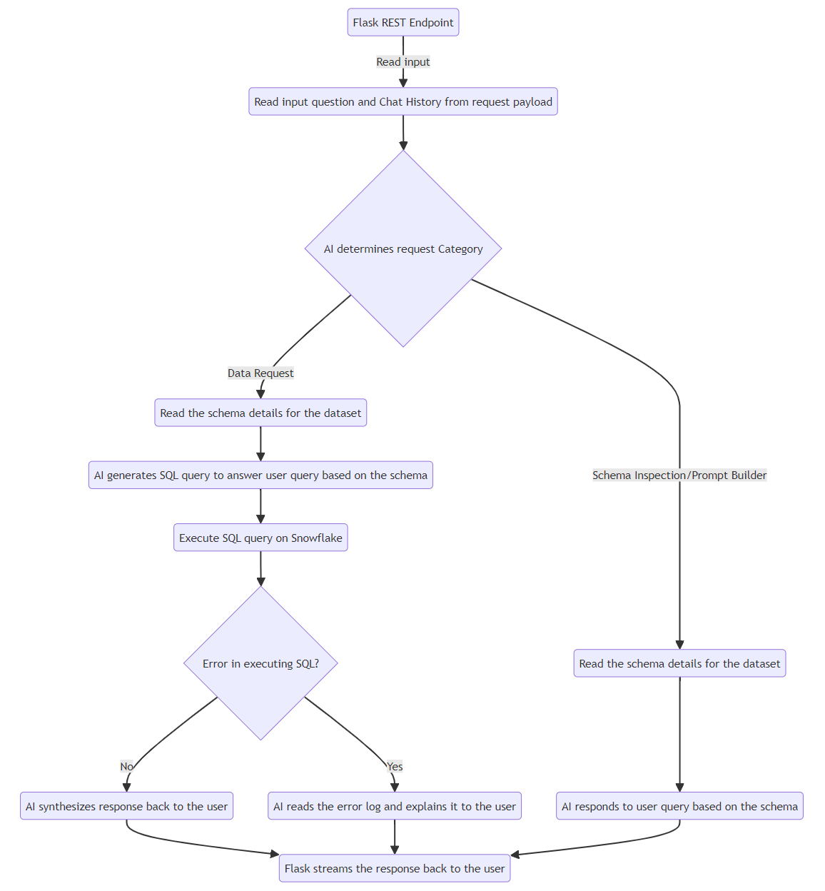

# SnowAI - Structured Data WebAPI

This repo contain code to WebAPI that responds to user's query in plain english with Structured data output retrieved from Data Warehouse.

### Deploy from your local machine

#### Python Setup
1. Install Python> 3.10
2. Create Virtual Env .venv
    ```sh
    python -m venv .venv
    ```
3. Activate virtual env
    ```sh
    .venv\Scripts\Activate.ps1
    ```
4. Install requirements
    ```sh
    pip install -r requirements.txt
    ```

#### Local Setup
1. Set the environment variables in .env file
    
    - AZURE_OPENAI_API_KEY
    - AZURE_OPENAI_MODEL
    - AZURE_OPENAI_ENDPOINT
    - AZURE_OPENAI_API_VERSION

    - SNOWFLAKE_USER
    - SNOWFLAKE_PASSWORD
    - SNOWFLAKE_ACCOUNT
    - SNOWFLAKE_WAREHOUSE
    - SNOWFLAKE_ROLE
    - SNOWFLAKE_DATABASE
    - SNOWFLAKE_SCHEMA


2. Start the app with command 
    ```sh
    python app.py
    ```

3. You can see the local running app at http://127.0.0.1.

4. Flow diagram for a sample API endpoint call

